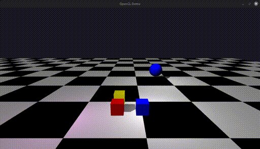

# OpenGL-Demo
Lightweight and modern 3D demo with OpenGL

This is a hobby 3D graphics project, primarily for learning more about rendering, developed on Linux.



## Requirements
- OpenGL 4.5+

## Features
- Modern OpenGL backend using Direct State Access (DSA)
- Efficient rendering pipeline with shared buffer access and draw batching to limit state switching
- Multiple rendering passes for deferring lighting and shadows
- GLTF model support with tinygltf (WIP)
- ECS architecture
- Behaviour components for adding scripts to objects

## Building
This project uses CMake without any special requirements, and can be built for example:
```
mkdir build
cmake -B build
cmake --build build
```

## Running
After building, launch OpenGL-Demo from the build folder, for example:

### Linux:
```
// Assuming current directory is the project root
./build/src/OpenGL-Demo
```

## Future
The is a long term ongoing personal project, I would like to reach the following milestones in time:
- Improved shadows
- Particle effects
- Advanced lighting effects
- Animations


## License
This project is licensed under the MIT license (see [LICENSE](LICENSE))

This project makes use of the following 3rd party libraries:
- glad
- glfw
- glm
- nlohmann (JSON parser)
- stb
- tinygtlf
